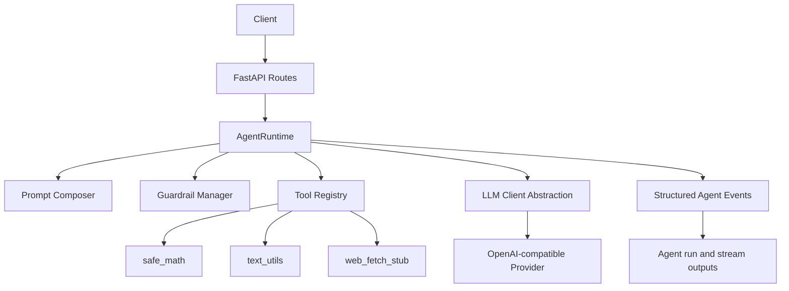

# Agentic AI Microservice API

A Python microservice runtime for steerable AI agents that can handle ambiguous multi-step tasks with safe tool use, strict execution guardrails, and structured observability.

This project is intentionally built as a portfolio-grade AI engineering artifact: clear architecture, strong typing, practical safety controls, and test coverage around critical failure modes.

## Why This Project Matters

Most AI demos stop at single-turn chat completion. This service implements a real agent runtime loop with:
- iterative reasoning
- controlled tool invocation
- budget-based termination
- traceable event logs
- safety and guardrail signals in the API response

It is designed for ambiguous tasks where the agent must decide assumptions, decompose work, and make progress without runaway loops.

## Key Features

- FastAPI service with clean, modular architecture
- OpenAI-compatible provider abstraction (Gemini-ready)
- Strong steerability with default prompt + per-request override
- Tool framework with JSON-schema argument validation
- Runtime guardrails:
  - max steps
  - max tool calls
  - max runtime seconds
  - repeated identical tool call detection
  - tool allowlist enforcement
- Tool output sanitization + prompt-injection-aware wrapping
- Structured events for every step
- SSE streaming endpoint scaffold (`/agent/stream`)
- Docker + docker-compose + Makefile + pytest suite

## Architecture



## Project Structure

  ```text
.
├── app/
│   ├── api/
│   │   ├── routes/
│   │   │   ├── agent.py
│   │   │   ├── health.py
│   │   │   ├── prompt.py
│   │   │   ├── tools.py
│   │   │   └── __init__.py
│   │   ├── deps.py
│   │   └── __init__.py
│   ├── core/
│   │   ├── config.py
│   │   ├── logging.py
│   │   ├── security.py
│   │   └── __init__.py
│   ├── agents/
│   │   ├── runtime.py
│   │   ├── planner.py
│   │   ├── prompts.py
│   │   ├── state.py
│   │   ├── guardrails.py
│   │   └── __init__.py
│   ├── llm/
│   │   ├── base.py
│   │   ├── openai_compatible.py
│   │   └── __init__.py
│   ├── tools/
│   │   ├── registry.py
│   │   ├── base.py
│   │   ├── safe_math.py
│   │   ├── web_fetch_stub.py
│   │   ├── text_utils.py
│   │   └── __init__.py
│   ├── schemas/
│   │   ├── requests.py
│   │   ├── responses.py
│   │   ├── events.py
│   │   └── __init__.py
│   ├── main.py
│   └── __init__.py
├── tests/
├── scripts/
├── .env.example
├── Dockerfile
├── docker-compose.yml
├── README.md
├── pyproject.toml
└── Makefile
```

## API Endpoints

- `GET /health`
  - service status and version

- `GET /tools`
  - available tools + descriptions + argument schemas

- `POST /agent/run`
  - runs agent to termination and returns:
    - final answer
    - tool call records
    - step trace
    - termination reason
    - budget usage
    - guardrail warnings

- `POST /agent/stream`
  - SSE stream of runtime events and final result

- `POST /prompt/preview`
  - composed system prompt + runtime settings + visible tool set

## Main Request Schema (`/agent/run`)

```json
{
  "task": "string",
  "system_prompt_override": "optional string",
  "max_steps": 8,
  "max_tool_calls": 12,
  "max_runtime_seconds": 45,
  "allowed_tools": ["safe_math", "text_utils"],
  "metadata": {"project": "demo"},
  "require_confirmation_for": ["web_fetch_stub"],
  "model": "models/gemini-2.5-flash",
  "temperature": 0.2
}
```

## Steerability Design

Steerability comes from a dedicated prompt composer (`app/agents/prompts.py`) that merges:
- a strong default system prompt focused on methodical, safe, and finite behavior
- optional per-request prompt override
- runtime guardrail settings (steps/tool calls/time)

`/prompt/preview` makes this inspectable and debuggable before execution.

## Guardrails and Security Design

Implemented controls:
- hard step/tool/runtime budgets
- repeated identical tool call detection
- allowlist-only tool access
- argument JSON validation via Pydantic
- tool timeout enforcement
- prompt-injection signal detection in tool outputs
- tool output sanitization + truncation
- explicit termination reason enum

Explicitly not included:
- arbitrary shell execution
- arbitrary filesystem access
- unrestricted network access
- unrestricted Python eval

## How Ambiguous Tasks Are Handled

The runtime adds a deterministic planning hint each run:
1. identify objective and constraints
2. declare assumptions when ambiguity exists
3. decompose into substeps
4. decide if tools are needed
5. synthesize final answer with uncertainty disclosure

### Example Ambiguous Task

Task:
"Design a lightweight migration plan to move our analytics jobs from cron scripts to a managed workflow system next quarter."

Typical behavior:
- agent states assumptions (team size, timeline, risk appetite)
- uses text tools for summarization/extraction if needed
- proposes phased plan with milestones and rollback criteria
- terminates cleanly with final answer before guardrail limits

## Quickstart

### 1. Prerequisites

- Python 3.11+
- Gemini API key

### 2. Install

```bash
pip install -e .[dev]
```

### 3. Configure Environment

```bash
cp .env.example .env
```

Set at minimum:

```env
GEMINI_API_KEY=your_key_here
LLM_BASE_URL=https://generativelanguage.googleapis.com/v1beta/openai/
LLM_DEFAULT_MODEL=models/gemini-2.5-flash
```

### 4. Run Locally

```bash
uvicorn app.main:app --reload --host 127.0.0.1 --port 8000
```

Docs:
- `http://127.0.0.1:8000/docs`

Web UI:
- `http://127.0.0.1:8000/`
- Includes run, stream, prompt preview, tool listing, and health checks.

## Example curl Requests

### Health

```bash
curl -s http://127.0.0.1:8000/health
```

### List Tools

```bash
curl -s http://127.0.0.1:8000/tools
```

### Prompt Preview

```bash
curl -s -X POST http://127.0.0.1:8000/prompt/preview \
  -H "Content-Type: application/json" \
  -d '{
    "task": "Draft a migration plan",
    "max_steps": 6,
    "max_tool_calls": 8,
    "max_runtime_seconds": 40,
    "allowed_tools": ["text_utils", "safe_math"]
  }'
```

### Run Agent

```bash
curl -s -X POST http://127.0.0.1:8000/agent/run \
  -H "Content-Type: application/json" \
  -d '{
    "task": "Create a risk-ranked 2-week plan for evaluating three managed workflow tools.",
    "max_steps": 8,
    "max_tool_calls": 10,
    "max_runtime_seconds": 45,
    "allowed_tools": ["text_utils", "safe_math", "web_fetch_stub"],
    "temperature": 0.2
  }'
```

### Stream Agent Events

```bash
curl -N -X POST http://127.0.0.1:8000/agent/stream \
  -H "Content-Type: application/json" \
  -d '{"task": "Analyze options and recommend one.", "max_steps": 5}'
```

## Testing

```bash
pytest -q
```

Covered scenarios:
- health endpoint
- tool registry
- request validation
- step-limit termination
- repeated tool-call guardrail
- disallowed tool access
- prompt preview behavior

## Troubleshooting

- If `/agent/run` returns `termination_reason: "rate_limit"`, your request reached Gemini quota or rate limits.
- In that case the API now returns a concise warning (`llm_rate_limited`) and a fallback `final_answer` with retry guidance.
- Typical fixes:
  - wait and retry after the suggested delay
  - switch to a model with available quota
  - use a key/project with billing or higher limits

## Developer Experience

Useful commands:

```bash
make install
make dev
make test
make lint
make format
make docker-build
make docker-up
```

## Design Tradeoffs

- Chosen: pragmatic, explicit runtime loop over framework-heavy orchestration
  - easier to audit and explain in interviews
- Chosen: OpenAI-compatible adapter interface
  - easy provider swapping, minimal abstraction overhead
- Chosen: conservative tool set
  - security and reliability over broad capability
- Deferred: persistence backend and distributed tracing stack
  - keeps MVP focused while leaving obvious extension paths

## Future Improvements

- add durable run storage (Postgres + run replay)
- add richer token accounting from provider-specific metadata
- add policy engine for fine-grained tool permissions
- add OpenTelemetry traces and metrics export
- add multi-agent role orchestration for complex workflows
